# Architecture

`subsyncd` is a headless, SQLite-authoritative subtitle acquisition service. Sonarr and Radarr supply media identity and lifecycle events; language-specific provider chains supply candidates; inventory, scoring, LAPSE, installation, and optional Silo notification form the processing pipeline. There is no management HTTP API or browser UI.

```mermaid
flowchart LR
    arr[Sonarr / Radarr] -- webhooks --> mut
    arr -- history and library --> recon[Reconciliation and discovery] --> mut
    mut[Transactional media mutation] --> queue[(SQLite search queue)]
    queue --> worker[Worker lease]
    worker --> inv[Inventory: embedded tracks and sidecars]
    inv --> prov[Provider chain per language]
    prov --> score[Identity gates and scoring]
    score --> lapse[LAPSE tournament]
    lapse --> install[Atomic installation and provenance]
    install --> outbox[(Notification outbox)] --> silo[Silo scan]
```

## Durable state and event flow

Webhooks and periodic Arr reconciliation converge on the same transactional media-mutation helper. It records an idempotent audit event, applies an import, rename, upgrade, or deletion, invalidates stale evidence when content changes, and updates every configured language search.

Reconciliation:

- fetches descending 100-record history pages with strict completeness and progress checks;
- reduces history by stable Arr entity (`movieId` or `episodeId`) and resolves the authoritative current entity;
- commits all resulting mutations and the cursor in one transaction, so any page failure leaves the prior cursor intact.

Because Arr history accepts only whole-second timestamps, the request overlaps the fractional persisted cursor; stable history event IDs and the same transaction make replay harmless.

The catalog keeps two identities deliberately. `entity_id` is the stable movie or episode and survives file replacement; `file_id` identifies the current physical Arr file and remains part of byte fingerprints, webhook events, workflows, installations, and hashes. An upgrade therefore updates one logical media row while invalidating evidence tied to the prior bytes. `github.com/cplieger/arrapi/v2` v2.0.5 owns bounded history and current-entity requests. A temporary hardened detail client owns only richer release, quality, edition, runtime, and provenance enrichment that arrapi does not expose.

Path mapping is also a scope boundary. A deliberately unmapped or safely mapped-outside-root entity becomes an outside-scope deletion/audit, so a narrow canary does not index or read the remaining Arr library. Traversal, malformed mappings, inaccessible paths, and unsafe filesystem resolution fail the page closed. Every persisted media row has a positive stable Arr entity ID. Startup performs no Arr request, identity backfill, or full-library scan.

SQLite state begins at `001_baseline.sql`. Databases containing migration names from the pre-release `001_initial.sql`–`010_media_entity_ids.sql` lineage are unsupported and rejected before migration SQL runs. Operators must preserve the old data directory for rollback and start this build with an empty one. The ordered migration runner applies later migrations after the baseline.

### Search queue

Search states in SQLite are the queue. The durable attempt counter tracks missing retries or unchanged upgrade checks according to priority. Retained valid installations remain upgrade work even when searches return no eligible candidates; successful replacements reset the counter, while missing sidecars restart acquisition backoff.

Dispatch order is, in turn:

1. priority class: import, then missing, then upgrade;
2. each instance's `queue_priority`;
3. a durable queue position that a throttle does not reset;
4. media order (title, series, season with specials last or a movie's year, episode), so a batch queued together runs show by show.

Provider cooldowns and the independent missing/technical schedules determine when work is eligible. The daemon leases nothing for a language and media kind while every provider on that route is unable to download. Advisory wakes reduce latency but carry no correctness: startup and recovery polling always rediscover due work. A change arriving during an active same-key lease preserves its owner and expiry, coalesces one rerun, and prevents a stale completion from restoring prior progress.

### Cooldown resume progress

For an unfinished first-install cooldown cycle, the search row also holds a strictly validated, bounded configured-order list of clean-empty provider IDs and a route signature.

- A provider becomes clean-empty only after broad completion without candidates and, if applicable, exact completion without candidates. Candidates, availability failures, and technical errors never create suppression state.
- The persisted signature hashes the canonical language/ordered-tier route together with media path, file ID, size, and nanosecond mtime; only the opaque digest is stored.
- The worker supplies the saved state only when the signature matches the assembled language workflow; otherwise it runs the full route and clears stale progress on completion. The workflow validates the signature before inventory and again after adopting the live inventory fingerprint, and inventory replacement transactionally clears every language's progress.
- Owner-guarded completion atomically retains the state only for throttled or retryable technical first-install outcomes and clears it for terminal, upgrade, media-reset, and rerun paths.
- The worker repository derives JSON-size and membership bounds from each accepted configured route, invalidates stale signatures before applying smaller current bounds, and checks the current fingerprint inside completion. This permits every accepted route, preserves exact provider-ID identity, and prevents stale in-flight completions from restoring old progress. Unscoped repository utilities perform structural JSON validation; daemon assembly always supplies the route policy.
- Completion returns the authoritative retained count, which worker lifecycle logs report as the low-cardinality `resume_provider_count`, never the provider list or route signature.

### Leases, shutdown, and locking

Workers lease only available concurrency slots, filtering current instance/language routes and active media before ordering and limiting claims. Removing a route preserves durable work for re-enable. Leases are renewed and completed by owner compare-and-swap. Deletion retains active ownership; completion leaves deleted media terminal, while reimport during that lease coalesces one rerun.

Shutdown stops new acquisition, waits one configured window, cancels active work, waits one more window, then returns even if a dependency ignores cancellation. Unfinished leases remain recoverable after expiry.

Mutating application assembly acquires the data-directory lock before database migration or durable initialization and retains it through close. Diagnostic assembly validates an existing current-schema database in read-only mode, without backfills or persistent cache construction. It can read the running daemon's WAL without taking its mutation lock.

## Media support boundary

Media fingerprints bind path, replaceable Arr file ID, size, and modification time. Embedded inventory requires a separately recorded completed-probe fingerprint, including empty probe results; catalog metadata alone cannot validate the cache. Inventory reads one catalog/probe/track snapshot and compares the original catalog identity when committing, so a stale probe cannot restore obsolete media. Expensive file hashes are also cached against exact physical identity; external sidecars are scanned live before every search. The separate stable entity ID is catalog identity, not evidence that two file versions have identical bytes.

A Sonarr media file associated with several consecutive episodes of one season is a range target (`episode`..`episode_end`). Its stable entity is the earliest episode. Every candidate must cover the whole range: a standard or absolute release-name range, a spanning range pack, or an exact hash; whole-season packs are not used.

- First-episode evidence alone is rejected before download.
- Pack selection accepts only covering filename ranges.
- Installation requires the subtitle to reach 75% of the runtime (`partial_coverage`).
- Single-episode-only providers are not searched.

Files whose episodes span seasons, leave gaps or lack numbers stay `unsupported_multi_episode` with terminal searches; that remains a durable fail-closed boundary, not silent first-episode behavior.

## Acquisition and publication

Each canonical language owns an ordered provider chain. Candidates pass identity gates and deterministic release scoring before any download. Exact hashes can install directly; policy-qualified strong first installs may use an auditable score bypass; other candidates enter the lazy score-tier LAPSE tournament. Each required candidate is prepared with one strict output-producing LAPSE invocation. Equal-score candidates rank by the resulting confidence, and the retained winning artifact installs without repeating LAPSE. Deterministic candidate failures are scoped and quarantined, while operational failures remain retryable.

Installation:

1. validates and stages a sidecar beside its destination and applies permissions;
2. fsyncs and atomically publishes it: a fresh sidecar is hard-linked so a file created concurrently at the destination is never overwritten (falling back to rename on filesystems without hard links), and a managed replacement is renamed;
3. fsyncs the directory and commits checksum-bound provenance.

Managed replacement uses a retained rollback copy. If cleanup, restoration, or directory sync also fails, that error is joined with the initiating error and the surviving file is protected rather than automatically adopted. Operator inspection is required for a valid-looking but untracked sidecar.

A committed installation may enqueue a checksum-deduplicated Silo notification. Notification leases and retries are independent, so notification failure never rolls back subtitle acquisition.

## Existing-library discovery

Concrete Sonarr/Radarr catalogs expose optional full-library enumeration via arrapi v2.0.5. A reconciler first performs one background discovery pass per configured scope; explicit scan forces another. Assembly/readiness remain offline. Sonarr lists series then their episode files, Radarr lists movies with files, and both scope-check before complete detail hydration. Missing library history does not prevent discovery.

Each instance persists its discovery scope and event revision. Discovery captures the revision before network work, then atomically inserts only unknown media with missing-priority searches and records completion if the revision still matches. Existing rows (including deleted rows), leases, schedules, rejections, and installations remain unchanged. Every inserted event advances the revision, including unknown entity/series deletions, so a concurrent webhook forces retry. History cursor advancement remains separate. A busy instance may delay discovery until an enumeration pass completes without a concurrent event. The snapshot is additive; its omissions never delete catalog rows.
